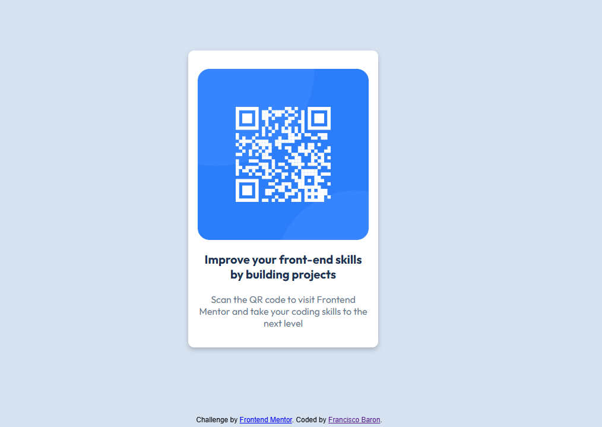

# Frontend Mentor - QR code component solution

This is a solution to the [QR code component challenge on Frontend Mentor](https://www.frontendmentor.io/challenges/qr-code-component-iux_sIO_H). Frontend Mentor challenges help you improve your coding skills by building realistic projects. 

## Table of contents

- [Overview](#overview)
  - [Screenshot](#screenshot)
  - [Links](#links)
- [My process](#my-process)
  - [Built with](#built-with)
  - [What I learned](#what-i-learned)
  - [Continued development](#continued-development)
- [Author](#author)

## Overview

### Screenshot

### Links

- Solution URL: (https://github.com/Kimichin98/qr-code-practice)
- Live Site URL: (https://kimichin98.github.io/qr-code-practice/)

## My process

### Built with

- Semantic HTML5 markup
- CSS custom properties
- Flexbox

### What I learned

I focused on core concepts like HTML structure and CSS properties to build and style this project.

I also learned how to modify images inside divs and flexboxes. Ultimately, I chose this project due to its simplicity and also as
a way to practice Git and Github commands.

### Continued development

I would love to build on this project and incorporate Javascript to it, possibly a framework like React as well in the near future.

## Author

- GitHub Profile - [Kimichin98](https://github.com/Kimichin98)

